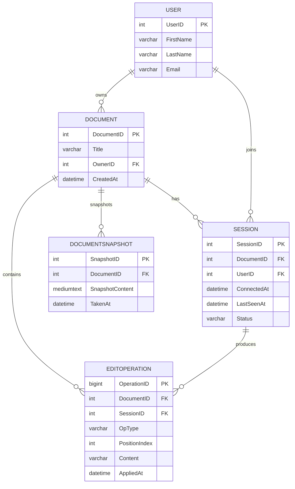

# CollabSpace ER Diagram

```mermaid
erDiagram
    USER ||--o{ DOCUMENT : owns
    DOCUMENT ||--o{ SESSION : has
    USER ||--o{ SESSION : joins
    DOCUMENT ||--o{ EDITOPERATION : contains
    SESSION ||--o{ EDITOPERATION : produces
    DOCUMENT ||--o{ DOCUMENTSNAPSHOT : snapshots

    USER {
        int UserID PK
        varchar FirstName
        varchar LastName
        varchar Email
    }
    DOCUMENT {
        int DocumentID PK
        varchar Title
        int OwnerID FK
        datetime CreatedAt
    }
    SESSION {
        int SessionID PK
        int DocumentID FK
        int UserID FK
        datetime ConnectedAt
        datetime LastSeenAt
        varchar Status
    }
    EDITOPERATION {
        bigint OperationID PK
        int DocumentID FK
        int SessionID FK
        varchar OpType
        int PositionIndex
        varchar Content
        datetime AppliedAt
    }
    DOCUMENTSNAPSHOT {
        int SnapshotID PK
        int DocumentID FK
        mediumtext SnapshotContent
        datetime TakenAt
    }
```
